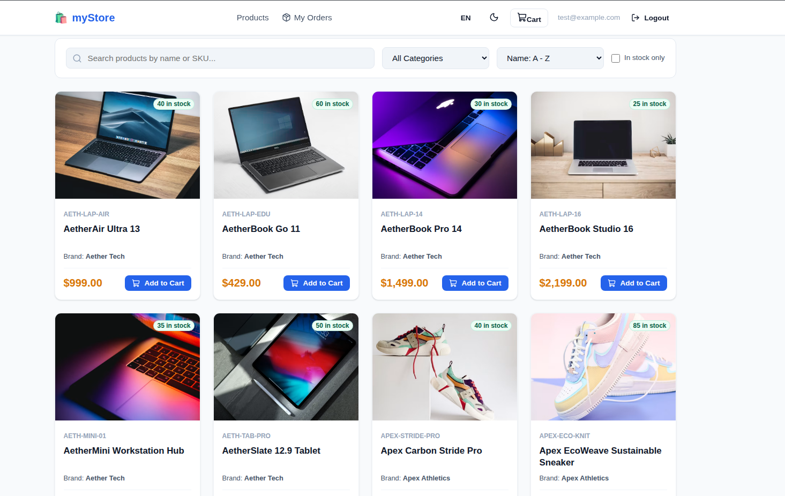
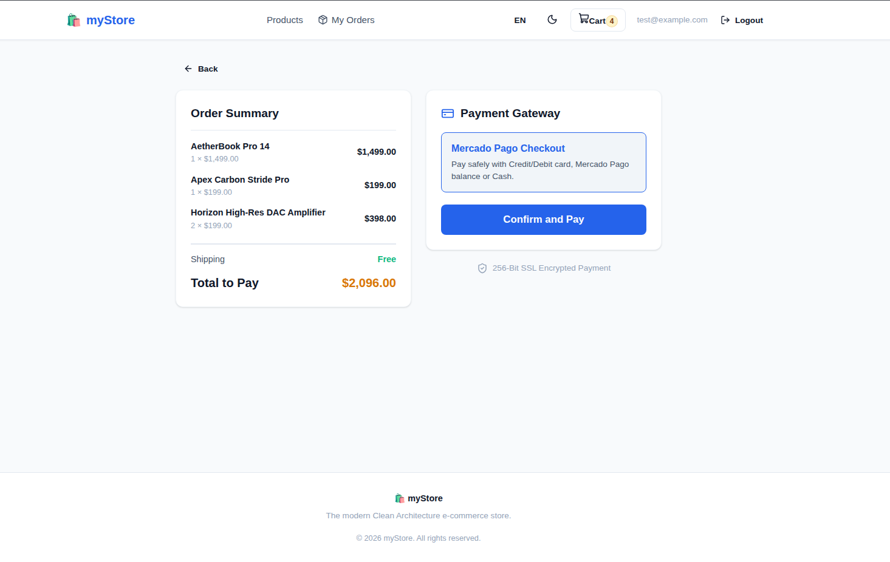
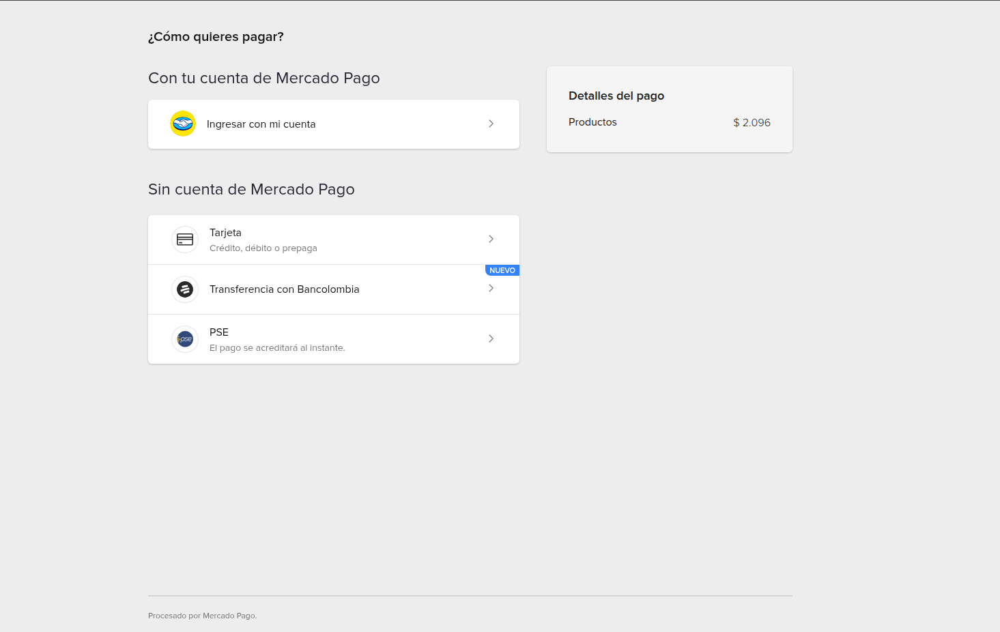
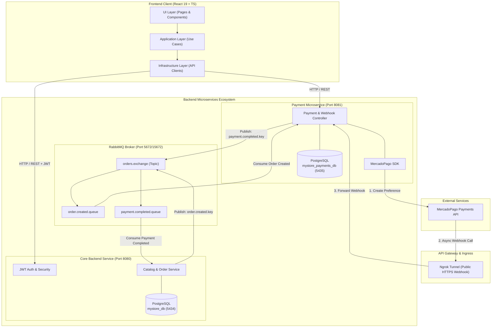

# 🛒 myStore — Enterprise Microservices E-Commerce Platform

[](https://www.oracle.com/java/)
[](https://spring.io/projects/spring-boot)
[](https://react.dev/)
[](https://www.typescriptlang.org/)
[](https://www.postgresql.org/)
[](https://www.rabbitmq.com/)
[](https://www.docker.com/)
[](https://www.mercadopago.com/)

An enterprise-grade, event-driven microservices e-commerce application built with **Java 21**, **Spring Boot**, **PostgreSQL**, **RabbitMQ**, **MercadoPago API**, and **React 19 with Clean Architecture**. 

The system leverages an **Event-Driven Architecture (EDA)** with asynchronous message passing over RabbitMQ, isolated **Database-per-Service** data modeling, **JWT Security** with refresh token rotation, and a full checkout pipeline integrated with **MercadoPago Webhooks** (exposed locally via **Ngrok**).

---

## 🌟 Key Features

- **🔐 Robust Security & Authentication**: JWT authentication with Access & Refresh Tokens, BCrypt password encryption, and Role-Based Access Control (`ROLE_USER`, `ROLE_ADMIN`).
- **📦 Catalog Management**: Full CRUD capability for Products, Categories, and Manufacturers with pagination, filtering, and SKU lookups.
- **🛒 Shopping Cart & Orders**: Persistent interactive cart, dynamic total calculation, order generation, and real-time status updates (`PENDING`, `PAID`, `CANCELLED`).
- **💳 Real-Time Payment Gateway**: Dynamic payment preference creation powered by the **MercadoPago Java SDK**, handling direct user payment checkout.
- **⚡ Async Event Processing**: Asynchronous communication between services using **RabbitMQ AMQP Topic Exchanges**.
- **🔔 Automated Webhook Processing**: Payment updates processed via MercadoPago Webhooks, tunnelled through **Ngrok** for seamless local development.
- **🛠️ Admin Dashboard**: Dedicated administrative interface for managing catalog inventory and auditing user orders.
- **🌐 Modern Clean Architecture Frontend**: React 19 SPA structured into Domain, Application, Infrastructure, and Presentation layers, featuring i18n internationalization (English/Spanish), theme toggle (Dark/Light), and custom notifications.

---

## 📸 Application Preview

### 1. Product Catalog & Storefront
Explore products with real-time category filtering, search, pagination, and shopping cart management.



---

### 2. Payment Gateway & Checkout Flow
Streamlined checkout process presenting transparent order summaries and launching payment preferences.



---

### 3. MercadoPago Sandbox Integration
Direct integration with MercadoPago's checkout gateway allowing real-time card processing and webhook callbacks.



---

## 🏗️ Architecture & System Design

`myStore` is built following **Microservices Architecture** principles and **Clean Architecture / Layered Architecture** standards.



### Event-Driven Flow (Order & Payment Lifecycle)

1. **Order Creation**: The user places an order on the React frontend. The **Core Backend** creates the order (`PENDING` status) in `mystore_db` and publishes an `OrderCreatedEvent` to RabbitMQ (`orders.exchange`).
2. **Payment Processing**: The **Payment Microservice** listens to `order.created.queue`, receives the event, and initializes a payment record in `mystore_payments_db`. It communicates with **MercadoPago** to generate an checkout preference URL.
3. **Asynchronous Webhook Callback**: When the user completes the payment on MercadoPago, MercadoPago fires a Webhook request to the public **Ngrok** endpoint. Ngrok forwards the callback to `PaymentWebhookController`.
4. **Order Status Resolution**: The Payment Service validates the payment status with MercadoPago and publishes a `PaymentCompletedEvent` to RabbitMQ. The Core Backend consumes this event and updates the order status to `PAID` or `CANCELLED`.

---

## 🛠️ Technology Stack

| Domain | Tech / Library | Description |
| :--- | :--- | :--- |
| **Backend Core** | Java 21, Spring Boot 4.1, Spring Security | Core framework, dependency injection, and REST API |
| **Authentication** | JJWT (io.jsonwebtoken), BCrypt | Stateless JWT Access Token + Refresh Token handling |
| **Databases** | PostgreSQL 16, Spring Data JPA, Hibernate | Relational storage per service with JPA ORM |
| **Migrations** | Flyway DB | Version-controlled database schema migrations |
| **Messaging** | RabbitMQ, Spring AMQP | Async event broker for microservices decoupled messaging |
| **Payment Gateway**| MercadoPago Java SDK v2.x | Checkout preference creation & Webhook validation |
| **Local Tunneling** | Ngrok | Secure public HTTPS URL generation for Webhook callbacks |
| **API Docs** | SpringDoc OpenAPI, Swagger UI | Interactive REST API documentation |
| **Frontend UI** | React 19, TypeScript, Vite, React Router 7 | Fast Single Page Application with strict type safety |
| **State & Styling** | Context API, Custom CSS Variables, Lucide Icons | Responsive UI design, dark/light theme switcher |
| **Containerization**| Docker, Docker Compose | Isolated multi-container deployment environment |

---

## 📁 Project Structure

```text
myStore/
├── assets/
│   └── images/
│       ├── mercadopago.png
│       ├── paymentGateway.png
│       └── products.png
├── backend/                        # Main Core E-Commerce Microservice (Port 8080)
│   ├── src/main/java/com/myStore/backend/
│   │   ├── config/                 # Security & Swagger configurations
│   │   ├── controller/             # REST Endpoints (Auth, Products, Orders, etc.)
│   │   ├── dto/                    # Request & Response Data Transfer Objects
│   │   ├── exception/              # Global Exception Handlers
│   │   ├── messaging/              # RabbitMQ Producers & Consumers
│   │   ├── model/                  # JPA Entities (User, Product, Order, etc.)
│   │   ├── repository/             # Data Access Repositories
│   │   ├── security/               # JWT Filters & UserDetails Service
│   │   └── service/                # Business Logic Services
│   ├── src/main/resources/
│   │   ├── db/migration/           # Flyway SQL migrations
│   │   └── application.yaml        # Spring Boot properties
│   ├── .env.example                # Template for environment variables
│   └── pom.xml
├── payment/                        # Payment Processing Microservice (Port 8081)
│   ├── src/main/java/com/myStore/payment/
│   │   ├── controller/             # Webhook & Payment endpoints
│   │   ├── dto/                    # Event & Payment DTOs
│   │   ├── messaging/              # RabbitMQ Producers & Consumers
│   │   ├── model/                  # Payment entity
│   │   ├── repository/             # Payment JPA Repository
│   │   └── service/                # MercadoPago Integration Service
│   ├── src/main/resources/
│   │   ├── db/migration/           # Flyway SQL migrations for Payments
│   │   └── application.yaml
│   ├── .env.example
│   └── pom.xml
├── frontend/                       # React 19 + TypeScript SPA Client
│   ├── src/
│   │   ├── application/            # Clean Architecture: Use Cases
│   │   ├── domain/                 # Clean Architecture: Entities & Interfaces
│   │   ├── infrastructure/         # Clean Architecture: HTTP Clients & Repositories
│   │   └── presentation/           # Clean Architecture: Components, Pages & Contexts
│   ├── package.json
│   └── vite.config.ts
├── docker-compose.yml              # PostgreSQL databases & RabbitMQ containers
└── README.md
```

---

## 🚀 Getting Started & Local Setup

Follow these step-by-step instructions to get `myStore` running on your local machine.

### Prerequisites

Ensure you have the following installed:
- **Java JDK 21** or higher
- **Node.js** (v20+) and **npm**
- **Docker** and **Docker Compose**
- **Maven** 3.9+ (or use included `mvnw` wrappers)
- **Ngrok CLI** (for MercadoPago Webhook testing)
- A **MercadoPago Developer Account** (for Sandbox credentials)

---

### Step 1: Start Infrastructure with Docker

Launch the PostgreSQL databases and RabbitMQ message broker using Docker Compose:

```bash
docker compose up -d
```

This starts:
- **Core Database**: PostgreSQL on port `5434` (`mystore_db`)
- **Payment Database**: PostgreSQL on port `5435` (`mystore_payments_db`)
- **RabbitMQ Broker**: AMQP port `5673`, Management Console port `15673`

---

### Step 2: Configure & Launch Core Backend Service

1. Navigate to the `backend` directory:
   ```bash
   cd backend
   ```
2. Create your `.env` configuration file based on `.env.example`:
   ```bash
   cp .env.example .env
   ```
3. Update `.env` with your preferred credentials:
   ```env
   # Database Configuration
   DB_HOST=localhost
   DB_PORT=5434
   DB_NAME=mystore_db
   DB_USER=your_postgres_user
   DB_PASSWORD=your_secure_password

   # JWT Security Configuration
   JWT_SECRET=YOUR_SECURE_64_CHARACTER_HEX_SECRET_KEY_GOES_HERE
   JWT_EXPIRATION_MS=86400000
   JWT_REFRESH_EXPIRATION_MS=604800000

   # RabbitMQ Configuration
   RABBITMQ_HOST=localhost
   RABBITMQ_PORT=5673
   RABBITMQ_MANAGEMENT_PORT=15673
   RABBITMQ_USERNAME=guest
   RABBITMQ_PASSWORD=guest
   ```
4. Build and run the Backend application:
   ```bash
   ./mvnw spring-boot:run
   ```
   The Core Backend runs at `http://localhost:8080`.

---

### Step 3: Configure Ngrok for MercadoPago Webhooks

MercadoPago needs a public URL to send webhook notifications when payments change state.

1. Start an Ngrok tunnel pointing to the Payment Service port (`8081`):
   ```bash
   ngrok http 8081
   ```
2. Copy the generated HTTPS Forwarding URL (e.g., `https://a1b2-34-56-78-90.ngrok-free.dev`).

---

### Step 4: Configure & Launch Payment Microservice

1. Navigate to the `payment` directory:
   ```bash
   cd payment
   ```
2. Create your `.env` configuration file based on `.env.example`:
   ```bash
   cp .env.example .env
   ```
3. Configure `.env` with your MercadoPago credentials and Ngrok URL:
   ```env
   # Server Port
   PORT=8081

   # Database Configuration
   DB_HOST=localhost
   DB_PORT=5435
   DB_NAME=mystore_payments_db
   DB_USER=your_postgres_user
   DB_PASSWORD=your_secure_password

   # RabbitMQ Configuration
   RABBITMQ_HOST=localhost
   RABBITMQ_PORT=5673
   RABBITMQ_USERNAME=guest
   RABBITMQ_PASSWORD=guest

   # Mercado Pago Credentials (Sandbox Access Token)
   MERCADOPAGO_ACCESS_TOKEN=TEST-YOUR-MERCADOPAGO-SANDBOX-ACCESS-TOKEN
   MERCADOPAGO_NOTIFICATION_URL=https://YOUR-SUBDOMAIN.ngrok-free.dev/api/v1/payments/webhook
   ```
4. Build and run the Payment microservice:
   ```bash
   ./mvnw spring-boot:run
   ```
   The Payment Microservice runs at `http://localhost:8081`.

---

### Step 5: Launch Frontend React Client

1. Navigate to the `frontend` directory:
   ```bash
   cd frontend
   ```
2. Install dependencies:
   ```bash
   npm install
   ```
3. Start the Vite development server:
   ```bash
   npm run dev
   ```
4. Open your browser at `http://localhost:3000` (or `http://localhost:5173`).

---

## 📖 API Documentation & Swagger UI

Both microservices expose interactive OpenAPI documentation via Swagger UI:

- **Core Backend API Docs**: [http://localhost:8080/swagger-ui.html](http://localhost:8080/swagger-ui.html)
- **Payment Microservice API Docs**: [http://localhost:8081/swagger-ui.html](http://localhost:8081/swagger-ui.html)
- **RabbitMQ Management Dashboard**: [http://localhost:15673](http://localhost:15673) *(Default credentials: guest / guest)*

---

## 🔑 Key REST Endpoints

### Authentication & Users
- `POST /api/v1/auth/register` — Register a new user
- `POST /api/v1/auth/login` — Authenticate user and receive JWT tokens
- `POST /api/v1/auth/refresh-token` — Refresh access token using valid refresh token

### Products & Catalog
- `GET /api/v1/products` — Retrieve paginated products with category filtering
- `GET /api/v1/products/{id}` — Get detailed product info by ID
- `POST /api/v1/products` — Create product *(Admin required)*
- `PUT /api/v1/products/{id}` — Update product *(Admin required)*
- `DELETE /api/v1/products/{id}` — Delete product *(Admin required)*

### Orders
- `POST /api/v1/orders` — Create new purchase order from shopping cart
- `GET /api/v1/orders` — Get current user's order history
- `GET /api/v1/orders/{id}` — Get specific order details

### Payments
- `GET /api/v1/payments/order/{orderId}` — Retrieve payment state for an order
- `POST /api/v1/payments/webhook` — Async notification webhook listener for MercadoPago callbacks

---

## 👤 Author & Credits

Developed with ❤️ by **antoniosanp**.

- **GitHub**: [@antoniosanp](https://github.com/antoniosanp)

---

## 📄 License

This project is open-source and available for educational and portfolio reference.
